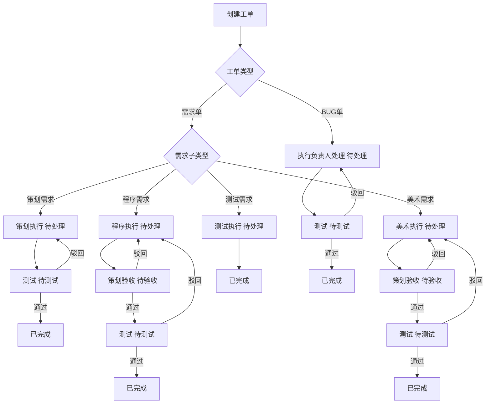

项目名称：TaskFlow 游戏团队工单协作平台

技术栈：
前端：Vue3 + Element Plus
后端：Flask
数据库：SQLite
接口风格：RESTful

一、项目介绍
该项目是一个为初创游戏研发团队打造的工单派发与项目管理平台，使用 Vue3 和 Flask 作为前后端框架，用于工作单创建、分配、跟进、统计与进度管理。

二、功能模块

1. 用户模块
- 用户登录、登出
- 用户管理（增删改查）
- 岗位分为：策划、美术、前端程序、后端程序、测试

2. 项目模块
- 项目增删改查
- 设置默认项目
- 项目进度统计

3. 工单模块
- 工单类型：需求单、BUG单
- 字段：标题、描述、模块、类型、子类型、负责人、开始时间、结束时间、状态、优先级、附件、修改历史
- 状态：待处理、处理中、待验收、已完成、已拒绝
- 可指派多个岗位成员

4. 工作台
- 我的待办、我的逾期、项目统计

5. 筛选与搜索
- 支持按项目、负责人、状态、类型、时间、优先级筛选

6. 统计报表
- 工单完成率、各岗位工作量、逾期统计、趋势图

7. 通知提醒
- 新工单、逾期、即将逾期提醒

8. 权限管理
- 管理员、普通成员权限控制

9. 看板视图
- 拖拽式工单状态管理

10. 评论沟通
- 工单评论、艾特成员、上传截图

三、页面
登录页、工作台、项目管理、用户管理、工单列表、工单详情、创建工单、统计页面

四、目标
简化游戏团队任务分配流程，明确责任人与截止时间，实时跟踪项目进度，自动统计团队工作效率。

---

## 五、当前实现说明

本仓库已实现一个可运行的前后端基础版本：

- 后端：`backend/app.py`（Flask + SQLite，RESTful API）
- 前端：`frontend/`（Vue3 + Element Plus 单页应用）
- 默认管理员账号：`admin`
- 默认管理员密码：`admin123`

已覆盖核心能力：

- 登录鉴权（Token）
- 用户管理（增删改查，管理员权限控制）
- 项目管理（增删改查、设置默认项目）
- 工单管理（增删改查、多负责人、状态/优先级/项目筛选）
- 工作台（我的待办、我的逾期、项目统计）
- 统计报表（完成率、岗位工作量、近7天趋势）
- 通知提醒（新工单、逾期、即将逾期）
- 评论沟通（工单评论与修改历史）
- 看板视图（按状态泳道展示，支持快速状态切换）

## 六、启动方式

## 六、工单流转规则（当前版本）

> 说明：本节为当前系统已落地的流转规则，优先于前文旧描述中的“多负责人自由流转”模式。

### 1) 工单类型与子类型

- 工单类型：`需求单`、`BUG单`
- 需求单子类型：`策划需求`、`程序需求`、`美术需求`、`测试需求`
- BUG单子类型：固定为 `BUG修复`

### 2) 流程状态

- `待处理`：执行节点处理中
- `待验收`：策划验收节点
- `待测试`：测试验证节点
- `已完成`：流程结束

### 3) 负责人规则（必填）

- 策划需求：执行负责人（必须是策划）+ 测试负责人
- 程序需求：执行负责人（必须是前端/后端程序）+ 策划负责人 + 测试负责人
- 美术需求：执行负责人（必须是美术）+ 策划负责人 + 测试负责人
- 测试需求：测试负责人（执行负责人与测试负责人等价，界面只保留测试负责人）
- BUG修复：执行负责人（岗位不限）+ 测试负责人

### 4) 节点动作与流转

- 执行节点：按钮 `提交`
- 验收节点（策划）：按钮 `通过` / `驳回`
- 测试节点：
  - 普通需求/BUG：按钮 `通过` / `驳回`
  - 测试需求：按钮 `提交`（提交即完成）
- 驳回：
  - 程序需求、美术需求：回退到执行负责人
  - 策划需求：回退到策划执行人
  - BUG修复：回退到执行负责人

### 5) 可见性与操作权限

- 工单在流程中默认只对“当前处理人”开放操作按钮（提交/通过/驳回）
- 工作台支持 `待我处理` 与 `我创建的` 双视图
- 创建人允许在“我创建的”中查看工单，但无权越过当前处理节点直接流转

### 6) 流转接口（后端）

- `POST /api/tickets/{id}/flow/submit`
- `POST /api/tickets/{id}/flow/approve`
- `POST /api/tickets/{id}/flow/reject`（需传 `reason`）

### 7) 流程图



## 七、启动方式

### 1) 启动后端

```bash
cd backend
python -m venv .venv
.venv\Scripts\activate
pip install -r requirements.txt
python app.py
```

后端默认运行在：`http://127.0.0.1:5000`

### 2) 启动前端

```bash
cd frontend
npm install
npm run dev
```

前端默认运行在：`http://127.0.0.1:5173`

前端已配置代理，访问 `/api/*` 会自动转发到后端。

## 八、安全与备份（轻量方案）

- 后端已内置安全响应头（CSP、X-Frame-Options、nosniff 等）
- 登录与上传接口已启用基础限流（防暴力请求）
- 附件上传已增加文件头签名（Magic Number）校验
- 鉴权失败、权限拒绝、限流拦截、上传拦截会写入后端日志（`logs/backend.log`）

### 1) 生产环境建议变量

```bash
export FLASK_DEBUG=0
export TASKFLOW_CORS_ALLOWED_ORIGINS="http://192.168.1.10:5173,http://localhost:5173"
```

也可使用环境文件（推荐）：

```bash
cp .env.example .env.production
# 按实际环境编辑 .env.production 后
./linux_service.sh start
```

说明：

- `linux_service.sh` 会在启动时自动加载 `.env.production`
- 可通过 `ENV_FILE=/path/to/your.env ./linux_service.sh start` 指定其他文件

### 2) 一键备份脚本（Linux）

仓库根目录提供：`linux_backup.sh`

```bash
chmod +x linux_backup.sh
./linux_backup.sh
```

默认行为：

- 备份 SQLite 数据库：`backend/instance/taskflow.db`
- 备份日志目录：`logs/`
- 备份附件目录（若存在）：`backend/instance/uploads/`
- 输出压缩包到：`backups/taskflow_backup_时间戳.tar.gz`
- 默认保留策略：`14` 天且最多 `20` 个备份包